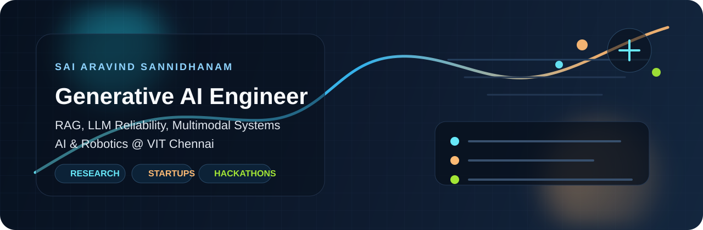

  

  <h1>Hi, I'm Sai Aravind Sannidhanam</h1>
  <h3>Building grounded, cost-efficient, multimodal AI systems from research to production</h3>

  

    
    
    
    
  

  

## About Me

- B.Tech in Computer Science and Engineering (AI & Robotics) at VIT Chennai with a CGPA of `8.41/10`.
- Generative AI Research Intern at `ProcurAI`, building citation-grounded legal AI systems and hallucination mitigation layers for enterprise workflows.
- Co-founded `Zyveo AI`, where I led multimodal content generation pipelines across scripts, captions, and thumbnails.
- Co-authored `CRISP`, a prompt-aware routing framework that reduced image-generation inference cost by up to `35%`.
- Winner of the `Samsung PRISM Spatial Hackathon 2025` and `Smart India Hackathon finalist` in both 2024 and 2025.

> I enjoy building AI products that are not just impressive in demos, but reliable, efficient, and genuinely useful in production.

## What I Build

| Focus Area | What That Looks Like |
| --- | --- |
| Reliable GenAI | Hallucination mitigation, citation retrieval, contradiction checks, response validation |
| LLM Systems | RAG pipelines, prompt engineering, embedding search, grounded enterprise assistants |
| Multimodal AI | Text-to-video flows, image generation routing, thumbnail pipelines, creativity scoring |
| Applied Research | Diffusion models, CLIP-based evaluation, ASR robustness, RL-based output control |

## Highlight Reel

| Milestone | Impact |
| --- | --- |
| ProcurAI | Built an LLM-powered clause analysis system for government tenders and helped cut ungrounded outputs by `40%+` |
| CADS, VIT Chennai | Co-authored `CRISP`, benchmarking generative models and optimizing routing for lower-cost creative generation |
| Zyveo AI | Shipped a multimodal content platform across `3+` verticals and drove image generation to around `$0.06` per output |
| Delta SF Residency + PW Battleground | Selected into a competitive startup residency and ranked among the top `20` founders from `1,000+` applicants |

## Featured Projects

| Project | Stack | Why It Stands Out |
| --- | --- | --- |
| [NoDelulu AI](https://github.com/Aravind22012005/NoDeluluAi) | Python, PPO, OpenAI API, RAG, TF-IDF, SerpAPI | Reinforcement learning-based control layer that monitors LLM responses and reduced hallucination by `30%+` |
| [VisionX](https://github.com/Aravind22012005/VisionX) | GPT-4, BeautifulSoup, Video APIs | Turns text prompts into coherent video narratives by scraping visuals and stitching them into story-driven outputs |
| Near/Far-Field Audio Analysis | TensorFlow, Keras, SciPy, STFT, RIR | Built an ASR robustness pipeline that won `Samsung PRISM Hackathon 2025` |
| Road Extraction from Satellite Imagery | OpenCV, Edge Detection | Computer vision pipeline for detecting emerging road structures from satellite imagery, finalist at `SIH 2024` |

## Tech Stack

  

  
  
  
  
  
  
  

## GitHub Pulse

  
  

  

## Let's Connect

- Email: `aravindsanni@gmail.com`
- LinkedIn: [linkedin.com/in/aravindsanni](https://www.linkedin.com/in/aravindsanni)
- Open to collaborations in `Generative AI`, `RAG`, `LLM reliability`, `multimodal AI`, and research-driven product building
